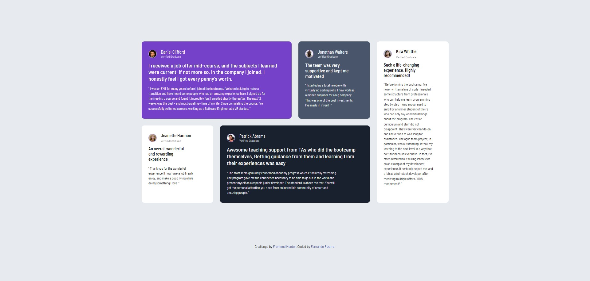

# Frontend Mentor - Testimonials Grid Section

This is a solution to the [Testimonials Grid Section challenge on Frontend Mentor](https://www.frontendmentor.io/challenges/testimonials-grid-section-Nnw6J7Un7). Frontend Mentor challenges help you improve your coding skills by building realistic projects.

## 📸 Screenshot

## 🔗 Live Site

[Live Site URL](https://fernandopizarrodw.github.io/Testimonials-grid-section-Fronted-Mentor/)

## 🛠️ Built With

- Semantic HTML5
- CSS Custom Properties
- CSS Grid
- Responsive Design
- Mobile-first workflow

## 🚀 What I Learned

Through this challenge, I reinforced my understanding of CSS Grid and how to manage custom layout adjustments using `grid-column` and `grid-row` for responsiveness. I also practiced structuring reusable card components with flexible text areas.

## 🔄 Continued Development

I'd like to improve how I handle content width without hardcoding values and continue exploring better ways to create adaptive layouts that don't rely heavily on pixel widths.

## 💡 Useful Resources

- [CSS Tricks - A Complete Guide to Grid](https://css-tricks.com/snippets/css/complete-guide-grid/) – This guide helped me understand `grid-template-areas`, `grid-column` and `grid-row`.
- [MDN Grid Layout](https://developer.mozilla.org/en-US/docs/Web/CSS/CSS_grid_layout) – Great documentation on all Grid properties.

## 👤 Author

- GitHub – [fernandopizarrodw](https://github.com/tu-usuario](https://github.com/fernandopizarrodw/Testimonials-grid-section-Fronted-Mentor))
- Frontend Mentor – [fernandopizarrodw](https://www.frontendmentor.io/profile/tu-usuario))
